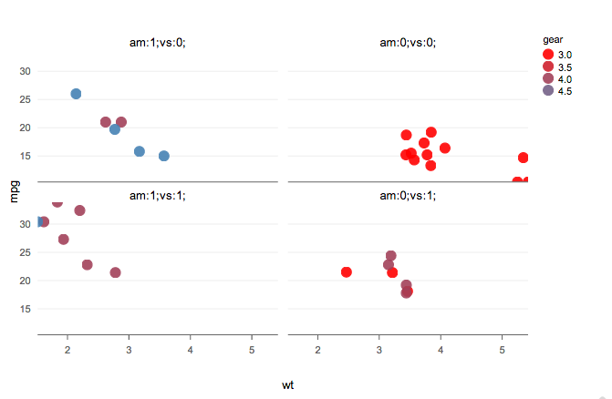
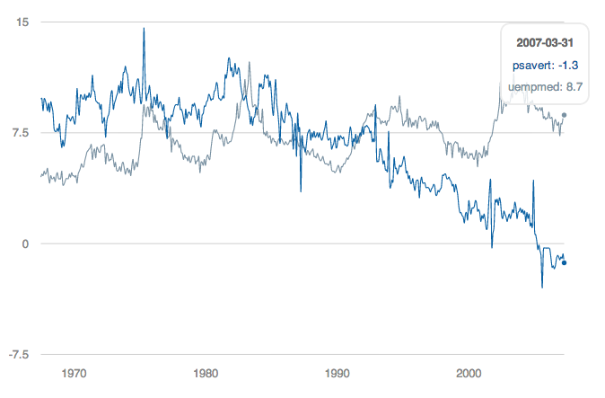
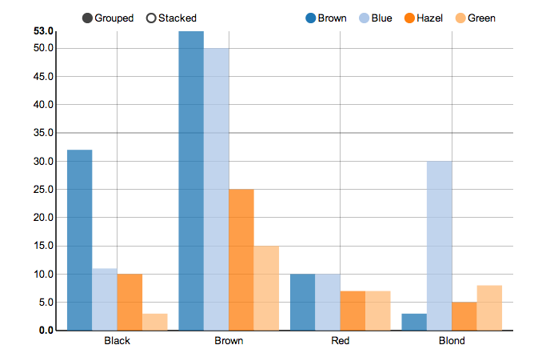
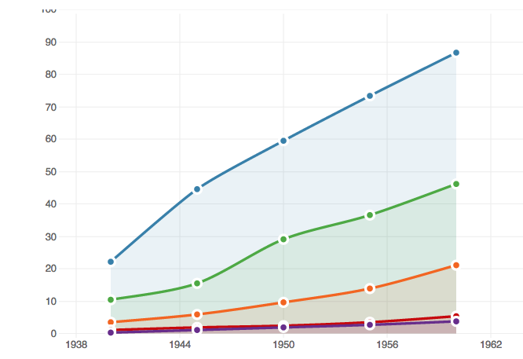
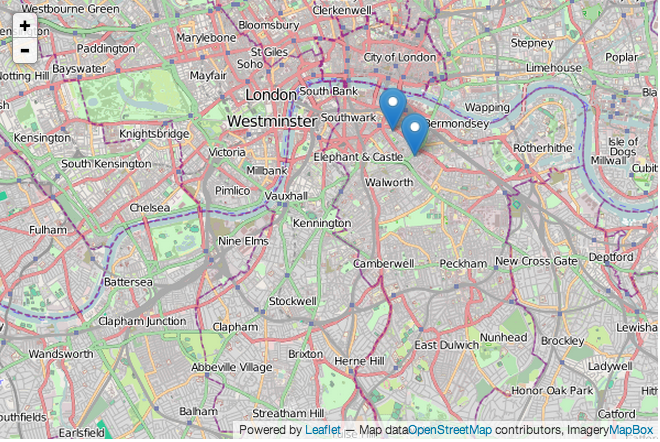
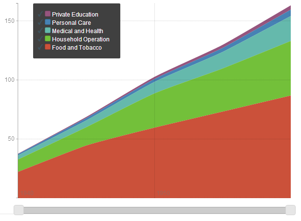

# rCharts

rCharts is an R package to create, customize and publish interactive javascript visualizations from R using a familiar lattice style plotting interface.

## Installation

You can install `rCharts` from `github` using the `devtools` package

```coffee
require(devtools)
install_github('rCharts', 'ramnathv')
```

## Features

The design philosophy behind rCharts is to make the process of creating, customizing and sharing interactive visualizations easy. 

### Create

`rCharts` uses a formula interface to specify plots, just like the `lattice` package. Here are a few examples you can try out in your R console.

```coffee
require(rCharts)

## Example 1 Facetted Scatterplot
names(iris) = gsub("\\.", "", names(iris))
rPlot(SepalLength ~ SepalWidth | Species, data = iris, color = 'Species', type = 'point')

## Example 2 Facetted Barplot
hair_eye = as.data.frame(HairEyeColor)
rPlot(Freq ~ Hair | Eye, color = 'Eye', data = hair_eye, type = 'bar')
```

### Customize

rCharts supports multiple javascript charting libraries, each with its own strengths. Each of these libraries has multiple customization options, most of which are supported within rCharts. More documentation is underway on how to use rCharts with each of these libraries.

#### [Polychart](https://github.com/Polychart/polychart2).

We will create our first chart using Polychart, a javascript charting library based on the grammar of graphics, and inspired by ggplot2.

```coffee
r1 <- rPlot(mpg ~ wt | am + vs, data = mtcars, type = 'point', color = 'gear')
r1
```



There, we have our first embedded chart with nice tooltips! Let me add some interactivity to this chart now using javascript.

```js
graph_chart1.addHandler(function(type, e){
  var data = e.evtData;
  if (type === 'click'){
    return alert("You clicked on car with mpg: " + data.mpg.in[0]);
  }
})
```

---

#### [Morris](https://github.com/oesmith/morris.js)

The next library we will be exploring is Morris.

```coffee
data(economics, package = 'ggplot2')
econ <- transform(economics, date = as.character(date))
m1 <- mPlot(x = 'date', y = c('psavert', 'uempmed'), type = 'Line',
  data = econ)
m1$set(pointSize = 0, lineWidth = 1)
m1
```



Hurray! There we have our second chart!

---

#### [NVD3](https://github.com/novus/nvd3)

Next, I will demonstrate my all time favorite d3js library, NVD3, which produces amazing interactive visualizations with little customization.

```coffee
hair_eye_male <- subset(as.data.frame(HairEyeColor), Sex == "Male")
n1 <- nPlot(Freq ~ Hair, group = "Eye", data = hair_eye_male, 
  type = 'multiBarChart')
n1
```



See the interactivity that comes at zero cost! 

---

#### [xCharts](https://github.com/tenXer/xcharts/)

The next library to demo would be xCharts, a slick looking charting library using d3js, made by TenXer.

```coffee
require(reshape2)
uspexp <- melt(USPersonalExpenditure)
names(uspexp)[1:2] = c('category', 'year')
x1 <- xPlot(value ~ year, group = 'category', data = uspexp, 
  type = 'line-dotted')
x1
```



There is your xChart

---

#### [HighCharts](http://www.highcharts.com/)

```coffee
h1 <- hPlot(x = "Wr.Hnd", y = "NW.Hnd", data = MASS::survey, 
  type = c("line", "bubble", "scatter"), group = "Clap", size = "Age")
h1
```


---

#### [Leaflet](http://leafletjs.com/)

```coffee
map3 <- Leaflet$new()
map3$setView(c(51.505, -0.09), zoom = 13)
map3$marker(c(51.5, -0.09), bindPopup = "<p> Hi. I am a popup </p>")
map3$marker(c(51.495, -0.083), bindPopup = "<p> Hi. I am another popup </p>")
map3
```



---

#### [Rickshaw](https://github.com/shutterstock/rickshaw)

```coffee
usp = reshape2::melt(USPersonalExpenditure)
p4 <- Rickshaw$new()
p4$layer(value ~ Var2, group = 'Var1', data = usp, type = 'area')
p4
```



### Share

rCharts allows you to share your visualization in multiple ways, as a standalone page, embedded in a shiny application, or in a tutorial/blog post.

#### Standalone

You can publish your visualization as a standalone html page using the `publish` method. Here is an example. Currently, you can publish your chart as a `gist` or to `rpubs`.

```coffee
## 
names(iris) = gsub("\\.", "", names(iris))
r1 <- rPlot(SepalLength ~ SepalWidth | Species, data = iris, 
  color = 'Species', type = 'point')
r1$publish('Scatterplot', host = 'gist')
r1$publish('Scatterplot', host = 'rpubs')
```

#### Shiny Application

rCharts is easy to embed into a Shiny application using the utility functions `renderChart` and `showOutput`. Here is an example of an [rCharts Shiny App](http://glimmer.rstudio.com/ramnathv/rChartApp/).

```coffee
## server.r
require(rCharts)
shinyServer(function(input, output) {
  output$myChart <- renderChart({
    names(iris) = gsub("\\.", "", names(iris))
    p1 <- rPlot(input$x, input$y, data = iris, color = "Species", 
      facet = "Species", type = 'point')
    p1$addParams(dom = 'myChart')
    return(p1)
  })
})

## ui.R
require(rCharts)
shinyUI(pageWithSidebar(
  headerPanel("rCharts: Interactive Charts from R using polychart.js"),
  
  sidebarPanel(
    selectInput(inputId = "x",
     label = "Choose X",
     choices = c('SepalLength', 'SepalWidth', 'PetalLength', 'PetalWidth'),
     selected = "SepalLength"),
    selectInput(inputId = "y",
      label = "Choose Y",
      choices = c('SepalLength', 'SepalWidth', 'PetalLength', 'PetalWidth'),
      selected = "SepalWidth")
  ),
  mainPanel(
    showOutput("myChart", "polycharts")
  )
))
```

#### Blog Post

rCharts can also be embedded into an Rmd document using `knit2html` or in a blog post using `slidify`. Here are a few examples of tutorials written using `rCharts` and `slidify`.

1. [Parallel Coordinate Plots](http://ramnathv.github.io/rChartsParCoords/)
2. [NY Times Graphics Tutorial](http://ramnathv.github.io/rChartsNYT/)

## More

### Credits

Most of the implementation in `rCharts` is inspired by [rHighcharts](https://github.com/metagraf/rHighcharts) and [rVega](https://github.com/metagraf/rVega). I have reused some code from these packages verbatim, and would like to acknowledge the efforts of its author [Thomas Reinholdsson](https://github.com/reinholdsson).

### License

rCharts is licensed under the MIT License. However, the JavaScript charting libraries that are included with this package are licensed under their own terms. All of them are free for non-commercial and commercial use, with the exception of __Polychart__ and __Highcharts__, both of which require paid licenses for commercial use. For more details on the licensing terms, you can consult the `License.md` file in each of the charting libraries.

### See Also

There has been a lot of interest recently in creating packages that allow R users to make use of Javascript charting libraries. 

- [gg2v](https://github.com/hadley/gg2v) by [Hadley Wickham](https://github.com/hadley)
- [clickme](https://github.com/nachocab/clickme) by [Nacho Caballero](https://github.com/nachocab)
- [rVega](https://github.com/metagraf/rVega) by [Thomas Reinholdsson](https://github.com/reinholdsson)

